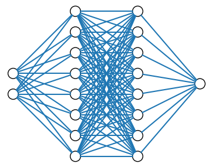

# NumPy MLP Implementation
After working with PyTorch quite a bit I decided that I had to implement the basic MLP from scratch at least once. The theoretical foundations were not new to me but I find the derivation of backpropagation using sum formulae unreadable. You'll find a rough overview and the derivation in matrix notation below.

## Project Structure
A yaml config file configures the basic network and training details like layer sizes, activation functions, loss function and more.
The main.py script is the main entrypoint and contains three configurable components:
- the path to the config file,
- a numpy definition of the target function that shall be approximated and
- the setup of the data sampler which is controlled by a `std` term that determines the amount of noise to apply to training samples and the x range to draw from.

Basic checkpointing is supported and also configured in the config file. Execute training/validation cycle by just running main.py. The loss curve will be drawn when done. 

The file `source/network.py` contains the entire network definition. 

## TODO
- Add batch support
- Add support for classification problems

## Theory: Multilayer Perceptron


The MLP consists of a series of layers. The above figure for example has $L=4$ layers with {2, 8, 8, 1} nodes from left to right. The input data can be of arbitrary dimension and the output is a scalar value.
Each node from a layer receives each output from the previous layer as input and returns one scalar value.
### Forward Pass: Single Layer
The basic equation for each node $j$ in the current layer $l$ is given by

```math
{a}^{l}_j= \hat{f}^l \left( {\sum}_k {W_{jk}^l } \right)
```


```math
{a}^{l}_j = \hat{f}^{l}\left( \sum_{k=1}^{K}{W^{l}_{jk} {a}^{l-1}_{k}} + {b}^{l}_{j}\right)
```

for $K$ values from the previous or input layer and the activation function $\hat{f}^l$.

Introducing matrix and Einstein notation, the equation for the entire layer $l$ is given by
$ \mathbf{a}^{l} = \hat{f}^{l}\left(\mathbf{W}^{l} \cdot \mathbf{a}^{l-1} + \mathbf{b}^{l}\right) $
if assuming that all nodes use the same activation function.

The key takeaways are:
- That the formula is generic for all layers (input, hidden and output) and
- That the layer output is a function of 3 parameters $\mathbf{a}^{l} = \mathbf{a}^{l}(\mathbf{a}^{l-1}, \mathbf{W}^{l}, \mathbf{b}^{l})$

Concerning the notation, the input to the first layer is generally denoted by $\mathbf{x}$ instead of $\mathbf{a^0}$ and the output by $\mathbf{y}$ instead of $\mathbf{a^L}$.

### Forward Pass: Entire Network
With the formula for a single layer, network can now be described by recursive application of the layers from the right (output) to the left (input). 
```math
\begin{align}
    \mathbf{y}  &= \mathbf{y}^L(\mathbf{a}^{L-1}, \mathbf{W}^{L}, \mathbf{b}^{L}) =  \hat{f}^L\left(\mathbf{W}^{L} \cdot \mathbf{a}^{L-1} + \mathbf{b}^{L}\right)\\
                &= \hat{f}^L\left(\mathbf{W}^{L} \cdot \left(\hat{f}^{L-1}\left(\mathbf{W}^{L-1} \cdot \mathbf{a}^{L-2} + \mathbf{b}^{L-1}\right)\right) + \mathbf{b}^{L}\right)\\
                &= \ldots \\
                &= \hat{f}^L\left(\mathbf{W}^{L} \cdot \left(\hat{f}^{L-1}\left(\mathbf{W}^{L-1} \cdot \left(\ldots \hat{f}^{1}(\mathbf{W}^{1} \cdot \mathbf{x} + \mathbf{b}^{1}) \ldots\right) + \mathbf{b}^{L-1}\right)\right) + \mathbf{b}^{L}\right)\\
\end{align}
```

### Backward Pass (Backpropagation)
Weights and biases of a neural network are updated by application of some adaption of the gradient descent algorithm. The efficient calculation of gradients by the backpropagation algorithm made larger networks feasible (alongside capable hardware of course) and is in essence just clever use of the chain rule.
In oder to train the network by gradient descent, i.E. find a solution with the lowest cost, a loss function $\hat{L}(\bar{\mathbf{y}}, \mathbf{y})$ is required where $\bar{\mathbf{y}}$ denotes the true solution. The most basic variants are **MSE** (Mean Squared Error) for regression problems and **BCE** (Binary Cross Entropy) for classification problems.

Introducing now the following
- $\hat{L}:= \hat{L}(\bar{\mathbf{y}}, \mathbf{y})$, 
- $\mathbf{z}^l(\mathbf{a}^{l-1}, \mathbf{W}^{l}, \mathbf{b}^{l}) := \mathbf{W}^l \cdot \mathbf{a}^{l-1} + \mathbf{b}^l$, 
- $\mathbf{a}^L(\mathbf{z}^L) := \mathbf{y}$,
- for $\frac{d\mathbf{z}^l(\mathbf{a}^{l-1}, \mathbf{W}^{l}, \mathbf{b}^{l})}{d\mathbf{W}^{l}} = \mathbf{a}^{l-1}$,
- and $\delta^l := \frac{d\mathbf{a}^l}{d\mathbf{z}^l}$. 

Provided implementations for the analytic derivative of functions like the loss $\mathrm{d}\hat{L}(\bar{\mathbf{y}}, \mathbf{y})$ and the activations $\mathrm{d}\mathbf{a}^l(\mathbf{z}^l) = (\hat{f}^l)'(\mathbf{z}^l)$ all required information is in place.


The gradient w.r.t. the weights of neurons in the last layer $L$ is given by:
```math
\begin{align}
\frac{d\hat{L}}{d\mathbf{W}^L} &= \frac{d\hat{L}}{d\mathbf{a}^L} \frac{d\mathbf{a}^L}{d\mathbf{W}^L} = \frac{d\hat{L}}{d\mathbf{a}^L} \frac{d\mathbf{a}^L}{d\mathbf{z}^L} \frac{d\mathbf{z}^L}{d\mathbf{W}^L}\\
    &= \frac{d\hat{L}}{d\mathbf{a}^L} \delta^L \otimes \mathbf{a}^{L-1}\ .
\end{align}
```

Equivalently, calculating the derivative w.r.t. the weights of the second to last layer $L-1$:
```math
\begin{align}
\frac{d\hat{L}}{d\mathbf{W}^{L-1}} &= \frac{d\hat{L}}{d\mathbf{a}^L} \frac{d\mathbf{a}^L}{d\mathbf{W}^{L-1}} = \frac{d\hat{L}}{d\mathbf{a}^L} \delta^L \frac{d\mathbf{z}^L}{d\mathbf{W}^{L-1}} \\
    &= \frac{d\hat{L}}{d\mathbf{a}^L} \delta^L \frac{d\mathbf{z}^L}{d\mathbf{a}^{L-1}} \frac{d\mathbf{a}^{L-1}}{d\mathbf{W}^{L-1}} \\
    &= \frac{d\hat{L}}{d\mathbf{a}^L} (\delta^L \cdot \mathbf{W}^L) \frac{d\mathbf{a}^{L-1}}{d\mathbf{z}^{L-1}} \frac{d\mathbf{z}^{L-1}}{d\mathbf{W}^{L-1}} \\
    &= \frac{d\hat{L}}{d\mathbf{a}^L} (\delta^L \cdot \mathbf{W}^L) \delta^{L-1} \otimes \mathbf{a}^{L-2} \ .
\end{align}
```

This scheme can be applied repeatedly until arriving at the $0$ layer which is then given by:
```math
\begin{align}
\frac{d\hat{L}}{d\mathbf{W}^{0}} &= \frac{d\hat{L}}{d\mathbf{a}^L} \quad (\delta^L \cdot \mathbf{W}^L) (\delta^{L-1}\cdot \mathbf{W}^{L-1}) \ldots (\delta^{1}\cdot \mathbf{W}^{1})\quad \delta^{1} \frac{d\mathbf{z}^{0}}{d\mathbf{W}^{0}} \\
 &= \frac{d\hat{L}}{d\mathbf{a}^L} \quad (\delta^L \cdot \mathbf{W}^L) (\delta^{L-1}\cdot \mathbf{W}^{L-1}) \ldots (\delta^{1}\cdot \mathbf{W}^{1}) \quad \delta^{1} \otimes \mathbf{x}
\end{align}
```
The $\otimes$ symbol is introduced to mark and overcome the dimension mismatch when replacing $\frac{d\mathbf{z}^L}{d\mathbf{W}^L} = \mathbf{a}^{L-1}$. This is by no means a mathematically sound notation. When implementing this translates to transposing $\mathbf{a}^{L-1}$. 

Derivatives w.r.t. biases $b^l$ are evaluated equivalently with the only difference being, that the last derivative term evaluates to $\frac{d\mathbf{z}^L}{d\mathbf{b}^l} = 1$.

By introducing the used abbreviations, the obtained equations are of a structure that helps to understand the core principle of backpropagation, the ability to cache and reuse calculations per layer.
The backpropagation algorithm is applied by executing the backward pass to the network layers in reverse ordering:
- Layer $L$ receives the analytic derivative of the loss function w.r.t. the output $\frac{d\hat{L}}{d\mathbf{a}^L}$ and returns $\frac{d\hat{L}}{d\mathbf{a}^L} (\delta^L \cdot \mathbf{W}^{L})$
- Layer $L-1$ receives  $\frac{d\hat{L}}{d\mathbf{a}^L} (\delta^L \cdot \mathbf{W}^{L})$ and returns $\frac{d\hat{L}}{d\mathbf{a}^L} (\delta^L \cdot \mathbf{W}^{L}) (\delta^{L-1} \cdot \mathbf{W}^{L-1})$
- ...
- Layer 0 receives  $\frac{d\hat{L}}{d\mathbf{a}^L} (\delta^L \cdot \mathbf{W}^{L})...(\delta^1 \cdot \mathbf{W}^1)$

Within each layer, the gradients for weights and biases are calculated and cached. The optimizer (gradient descent algorithm) is finally applied by iterating over all layers and updating weights and biases.
